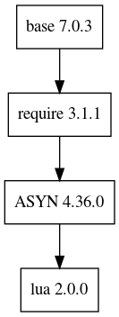

e3-lua  
======
ESS Site-specific EPICS module : lua

## Limited Implementation
Current implemenation does not fully support the generic `lua` implemenation, or maybe I don't understand fully how `lua` works. However, at least we can run `lua` scripts with limited situations. 

## Dependency Plot

||
| :---: |
|**Figure 1** Depdendency Tree. |
